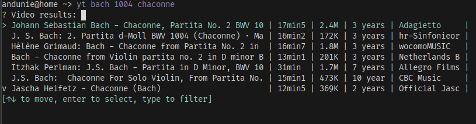
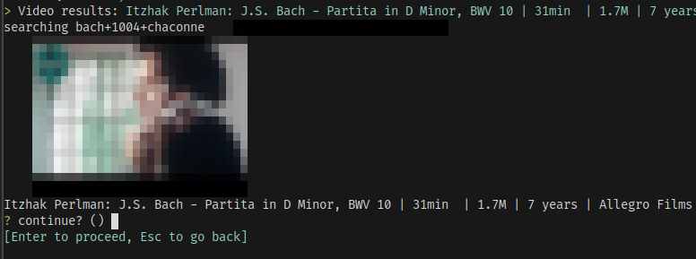
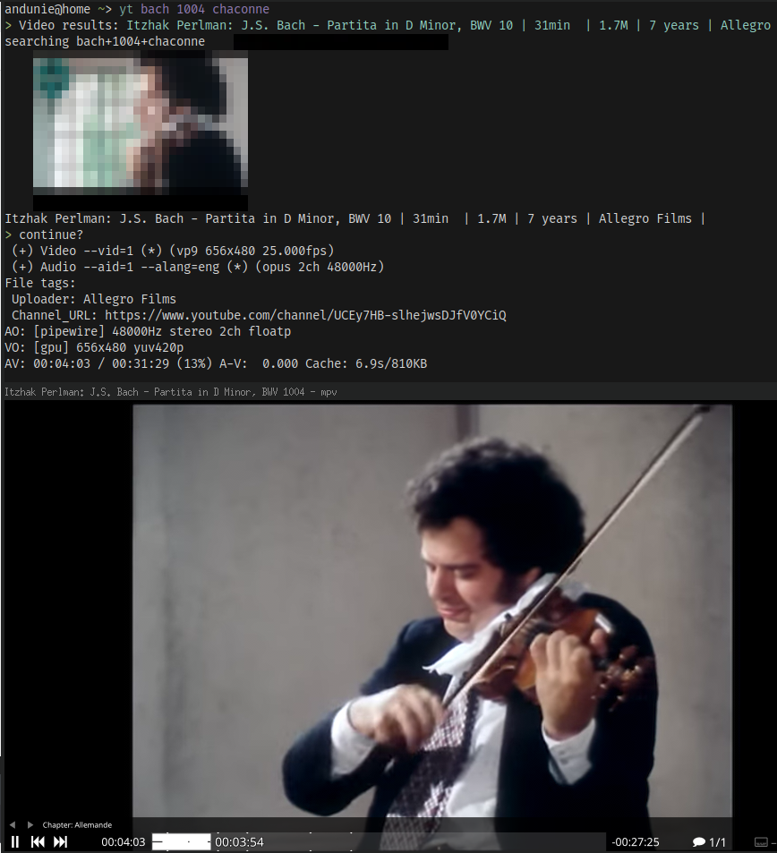

yt
==

A simple CLI wrapper for Invidious search API and the `yt-dlp`/`mpv` combo.

```
cargo install yt
```

You need an `mpv` installation with the `youtube-dl` or `yt-dlp` script hooked up so it can handle YouTube URLs.

Then call this with:

```
~> yt bach brandenburg
```

And you'll get a list of search results to pick from.

## Screenshots

_search_


_confirm_


_watch_

